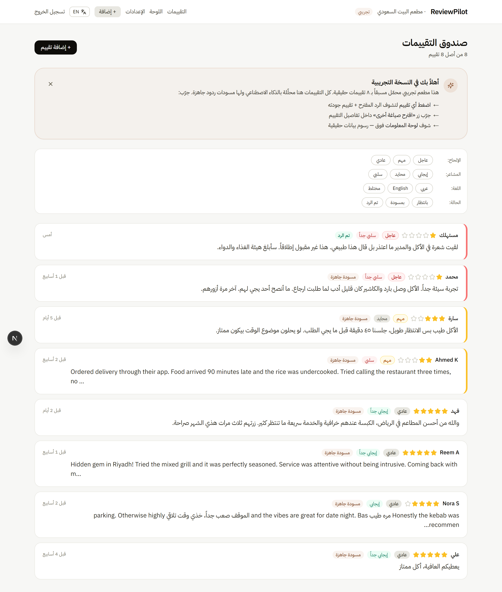
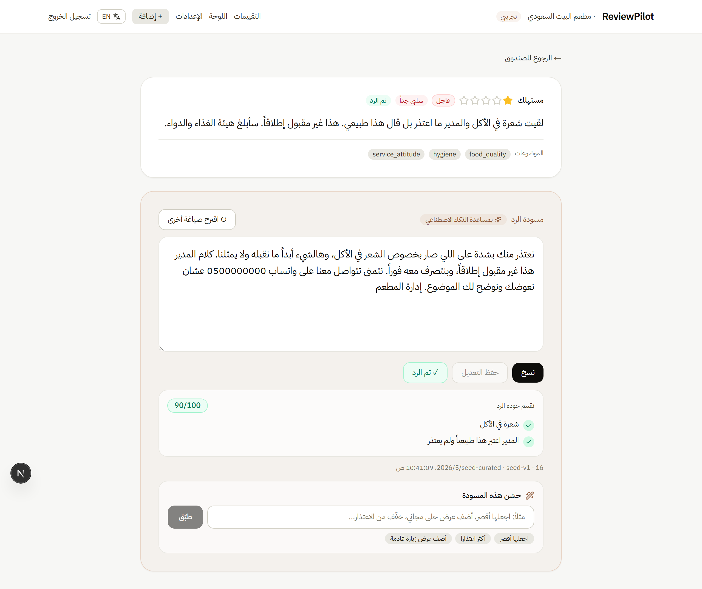
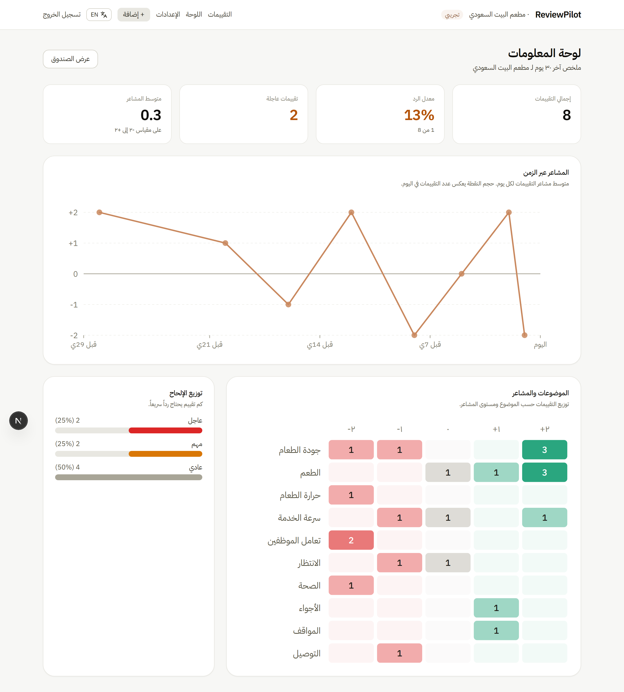
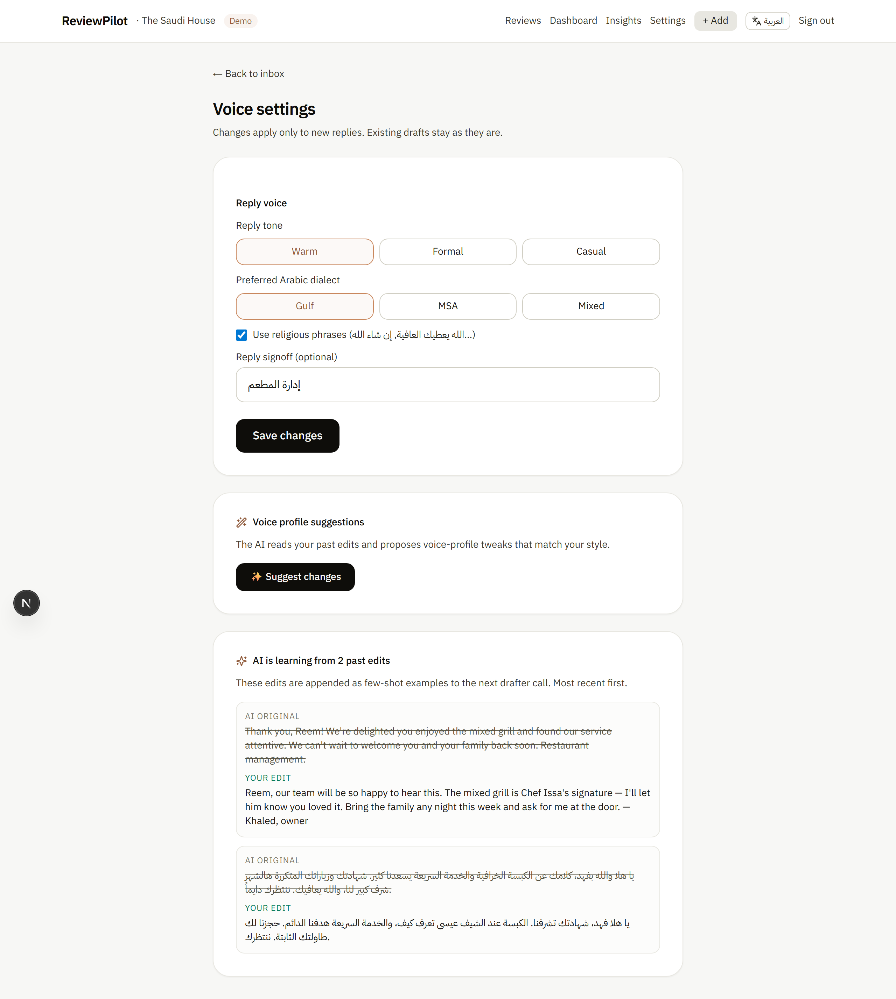
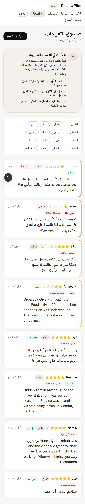

# ReviewPilot

**AI-drafted Google review responses for Saudi restaurants — in the reviewer's language and the restaurant's voice.**

Reviews come in Arabic (Gulf or MSA), English, or code-switched. ReviewPilot reads each review, drafts a culturally-correct reply that **matches the reviewer's dialect and the restaurant's tone profile**, and gives the owner an inbox where they edit, copy, and mark-as-responded in seconds.



---

## ➡️ Try the live demo

**[reviewpilot-drab-two.vercel.app](https://reviewpilot-drab-two.vercel.app)** — click "جرّب العرض التجريبي" / "Try the live demo" on the landing hero. **One click, no signup.** You'll land in a pre-seeded restaurant with 8 real-feel reviews already analyzed and draft replies ready to copy.

<!--
Demo video slot — record a 30–60s walkthrough and drop it here.

Recording options:
- macOS:    Cmd+Shift+5 → record selection
- Windows:  Win+G → Game Bar → screen capture
- Either:   Loom (loom.com) — easiest; gives an embeddable link
- Either:   ScreenToGif (windows) → GIF you can drop in public/demo.gif

To embed:
  - GIF:       
  - mp4 file:  <video src="public/demo.mp4" controls width="720"></video>
  - Loom:      paste the share link directly (GitHub renders the preview)

Suggested flow to capture:
  1. Landing → click "Try the live demo"
  2. Inbox → urgent hygiene review (top)
  3. Detail → show quality check, click "اقترح صياغة أخرى" → wait for new draft → switch between drafts
  4. Type "اجعلها أقصر" in the improve input → Apply → new draft appears
  5. Manual paste flow: /inbox/new → paste a review → watch the AI stream the response
  6. Dashboard → show charts
  7. Click EN toggle → whole UI flips to English
-->

## Screenshots

| | |
|---|---|
|  |  |
| Review detail — analyzer tags + editable draft + AI quality grade + improve-this-draft + multi-draft switcher | Dashboard — sentiment-over-time, topic × sentiment heatmap, urgency split |
|  |  |
| Settings — change formality / dialect / religious / signoff after onboarding | Mobile inbox at 375px — RTL, hamburger-free flex-wrap nav |

---

## What's built

| Surface | What it does |
|---|---|
| **Landing** (`/`, `/en`) | Bilingual (Arabic primary, English at `/en`) with waitlist form |
| **Auth** | BetterAuth magic-link via Resend (console-fallback in dev) + a portfolio-only "demo mode" cookie for visitors |
| **Onboarding** | Voice profile picker — formality, dialect, religious phrases, signoff |
| **Inbox** | RTL-first list, urgency-first sort, chip filters by urgency / sentiment / language / status |
| **Detail view** | Review + AI analysis tags + editable draft + copy to clipboard + mark-as-responded |
| **Regenerate** | Second AI call at higher temperature → alternative draft you can switch to |
| **AI quality check** | Third AI call after each draft scores it against each issue the reviewer raised (✓/✗ per issue, 0–100 overall) |
| **Manual paste** | Drop a review text in, get analysis + draft + quality check in ~10–15s |
| **Settings** | Edit the voice profile after onboarding; new drafts pick up the new voice |
| **Dashboard** | Sentiment-over-time line chart, topic×sentiment heatmap, urgency split, response-rate stat |
| **Improve this draft** | Free-form instruction input ("make it shorter", "more apologetic") → AI rewrites the current draft and saves it as a new version |
| **Streaming AI** | Manual paste streams the draft character-by-character — no spinner block |
| **Bilingual UI** | One-click EN/AR toggle in the top bar; chrome flips between Arabic (RTL) and English (LTR) instantly |
| **Learn-from-edits** | When you edit an AI draft and save, your edits become few-shot examples for the next draft. The AI literally adopts your voice with use — no fine-tuning. |
| **Customer timeline** | Click any author's name in the inbox → see all their reviews and your replies across time, with stats (visit count, avg rating, days since last visit) |
| **Bulk paste** | Paste many reviews at once, separated by `---` blocks. Each gets analyzed + drafted sequentially with per-entry progress and quota-aware stopping. |
| **Severity classifier** | Second classifier dimension beyond urgency: `urgent_action` / `direct_reply` / `monitor` / `spam`. Lets the inbox split "respond on Google" vs "call the customer offline" vs "ignore". |
| **Topic trends** | Dashboard tile: top 5 topics by 7-day-vs-28-day-baseline delta with up/down/new indicators. A spike in hygiene complaints lights up red. |
| **Schedule-for-later** | Owner picks a future publish time on the detail page; Vercel cron flips the status when the time hits. Real GBP-posting is deferred. |
| **Auto-tune voice profile** | "Suggest profile changes" button on /settings: AI reads recent edits + current profile and proposes per-field changes ("lower formality" / "add custom rule: name the chef") with rationale + confidence. Owner applies or skips per-field. |
| **Reply policy generator** | `/insights` page: meta-AI reads 20 review→reply pairs and extracts the implicit policies you follow ("For 1-2★ delivery: apologize specifically + offer WhatsApp"). Save any policy to your voice profile to lock it into future drafts. |

## Architecture

```
                ┌──────────────────────┐
   Reviewer ───►│  Next.js App Router  │
                │  (RTL-first, server- │
                │   actions for writes)│
                └──┬──────────────┬────┘
                   │              │
                   ▼              ▼
        ┌─────────────────┐  ┌─────────────────┐
        │ Gemini Flash-Lite│  │ Gemini Flash    │
        │  (analyzer:     │  │  (drafter:      │
        │   sentiment,    │  │   in-voice      │
        │   topics,       │  │   reply, typed  │
        │   urgency,      │  │   responseSchema)│
        │   typed schema) │  │                 │
        └────────┬────────┘  └────────┬────────┘
                 │                    │
                 ▼                    ▼
              ┌──────────────────────────┐
              │  Drizzle ORM             │
              └────────────┬─────────────┘
                           ▼
              ┌──────────────────────────┐
              │  Neon Postgres (free)    │
              └──────────────────────────┘

Auth path (parallel):
  Email → BetterAuth magic-link → Resend (or console in dev)
  Demo button → signed cookie → seeded demo user (portfolio shim)
```

Every AI call goes through one file (`src/ai/client.ts`) — swap providers by changing that file. The two prompts (`src/ai/analyzer.ts`, `src/ai/drafter.ts`) carry all of the Saudi-specific logic: dialect detection rules, forbidden-phrase list in both English (`"We strive to..."`) and Arabic (`"نسعى دائمًا..."`, `"ملاحظاتكم القيمة"`), register-matching, signoff-language matching.

## Interesting AI choices

- **Two-tier model pipeline.** Flash-Lite for cheap fast analysis (sentiment / topics / urgency), Flash for drafts where quality matters. Both use Gemini's typed `responseSchema` so the model can't invent fields.
- **Reviewer-register matching, not restaurant-register matching.** A doctor writing formal MSA gets a formal MSA reply, even if the restaurant's profile says Gulf casual. Same rule for code-switched reviewers — the draft mirrors their mix.
- **Forbidden phrases.** Both English and Arabic AI clichés are explicitly blocked (`"We strive to provide..."`, `"Thank you for taking the time..."`, `"نسعى دائمًا"`, `"ملاحظاتكم القيمة"`, `"نتطلع لخدمتكم"`). Found and added these through iteration on real sample reviews.
- **Signoff language matching.** Voice profile signoff is `"إدارة المطعم"` by default — for English responses the drafter translates it to `"Restaurant management"` rather than producing a half-Arabic-half-English close.
- **Sample-driven prompt iteration.** [`samples/reviews.ts`](samples/reviews.ts) holds 25 realistic Saudi reviews (Gulf rave, hygiene complaint with regulator threat, delivery-app context, prayer-time issue, allergy reaction, expat writing English, formal sheikh, code-switched). `npm run ai:test` runs the engine against all of them.
- **Retry/backoff that honors Gemini's `retryDelay`** in 429 errors, instead of fixed exponential. Cuts wasted wait time when the API tells us exactly how long.
- **AI quality-check meta-grading.** After the drafter produces a response, a third Flash-Lite call grades the draft against each concrete issue the reviewer raised — does the draft acknowledge the cold food, the 90-minute delay, the rude staff? Stored alongside the draft and rendered inline as ✓/✗ per issue. Failure-tolerant: if the check 429s or fails to parse, the draft still saves and the UI hides the card. See `src/ai/quality.ts`.
- **Streaming draft generation.** The manual-paste flow uses `generateContentStream` and SSE so the owner watches the AI type the response character-by-character (no spinner block, no 10-second blank wait). Server-Sent Events emit `analysis` → `chunk`* → `draft` → `quality` → `done`; the client reads via `fetch.body.getReader()`. See `src/app/api/draft/route.ts`.
- **"Improve this draft" — conversational AI on top of regenerate.** The owner types a free-form instruction like *"اجعلها أقصر"* or *"more apologetic"*; the model rewrites the current draft preserving language/register while obeying the instruction. New draft row, accessible via the draft switcher. See `src/ai/improve.ts`.
- **Bilingual UI** with a one-click EN/AR toggle stored in a cookie. App chrome (nav, page titles, badges, filters, dashboard panels, settings form) reads from a single `src/lib/app-copy.ts` keyed by locale. Review/draft content keeps its own per-review language regardless — the toggle is for the UI, not the data.
- **Learn-from-edits — the closest thing to fine-tuning we ship without retraining.** Every time the owner edits an AI draft and saves, `(reviewText, original_draft, owner_edit)` becomes a few-shot example in the next drafter call's system prompt. Bounded at 5 examples to keep token cost stable. See `src/ai/owner-edits.ts`. Visible in `/settings` ("AI is learning from N past edits") and in `/inbox/new` (caption under the submit button).

## Run locally

```bash
git clone https://github.com/abdulelah-cs7890/reviewpilot
cd reviewpilot
npm install

# Copy env template and fill in your keys
cp .env.example .env.local
# At minimum, set GEMINI_API_KEY (free at aistudio.google.com/apikey)
# and DATABASE_URL (free at neon.tech)

npm run db:generate
npm run db:migrate
npm run db:seed      # creates the demo restaurant with 8 pre-analyzed reviews
npm run dev          # http://localhost:3000
```

To regenerate the README screenshots after a UI change:

```bash
npx playwright install chromium   # one-time
npm run dev                       # leave running in another terminal
npm run screenshots               # writes 6 PNGs to public/screenshots/
```

Then click "Try the demo" on `/login` to skip the email step.

To exercise the AI engine directly without the UI:

```bash
npm run ai:test                          # all 25 sample reviews, warm voice profile
npm run ai:test -- --id=urgent-hygiene   # one specific review
npm run ai:test -- --profile=formal      # change voice profile
```

## Tech

- **Next.js 15** (App Router) · **TypeScript** · **Tailwind CSS**
- **Drizzle ORM** on **Neon Postgres** (free tier)
- **BetterAuth** with magic-link plugin + Resend
- **Gemini Flash-Lite** (analyzer) + **Gemini Flash** (drafter) via `@google/genai`, typed `responseSchema`
- **Zod** for server-action input validation
- **IBM Plex Sans Arabic** + **Inter** via `next/font`

## What's deferred (intentionally)

This is a portfolio project, not a real launch. The original product story includes integrations that need paid infra or business-identity verification — those are scoped out and documented as future work:

- **Google Business Profile API** integration (manual paste is the v1 review source; the schema already supports a `source: 'google'` enum value for narrative continuity)
- **WhatsApp Cloud API** daily digest (Meta Business verification is a 1–2 week dance)
- **Inngest background jobs** (manual paste fires the analyze+draft inline from the server action; ~6–10s is fine for a demo)
- **Real email digests** via Resend (the magic-link sender exists; periodic digests don't)
- **Multi-user / teams** — the schema models 1 user → 1 restaurant
- **Provider migration** — `src/ai/client.ts` is a one-file swap to Groq / Cohere / local Ollama if Gemini quotas ever bite. Not switched today because Gemini's Gulf-dialect quality is the validated baseline.

## Quota note

Gemini free tier is **20 requests/model/day** as of 2026-05-15. The demo button + seeded reviews use **zero** API calls so visitors can explore freely. Manual-paste and regenerate use ~2 calls each; if the daily quota hits, those flows surface a friendly Arabic "demo at capacity, try tomorrow" message instead of crashing.

## Notes for portfolio reviewers

- **The "demo mode" button is a deliberate shim** for portfolio reviewers — it's a signed cookie that bypasses the magic-link flow so you can explore without setting up email. In a real production deployment this would not exist; only the magic-link path would. See `src/lib/auth-utils.ts` for the implementation + the comment block explaining the trade-off.
- **The provider abstraction in `src/ai/client.ts`** was built on purpose — the original prompt iteration was against Claude, and the swap to Gemini was a one-file change. The abstraction stays as a hedge against rate-limit or quality changes from either vendor.
- **Sample reviews are deliberately diverse** — not just to look impressive but because each one exposes a real failure mode (dialect misclassification, signoff language mismatch, urgent-vs-medium scoring on allergy complaints). The `samples/reviews.ts` file is the source of truth for prompt iteration.

---

*Built solo as a portfolio project. Not affiliated with any restaurant or restaurant tech company.*
