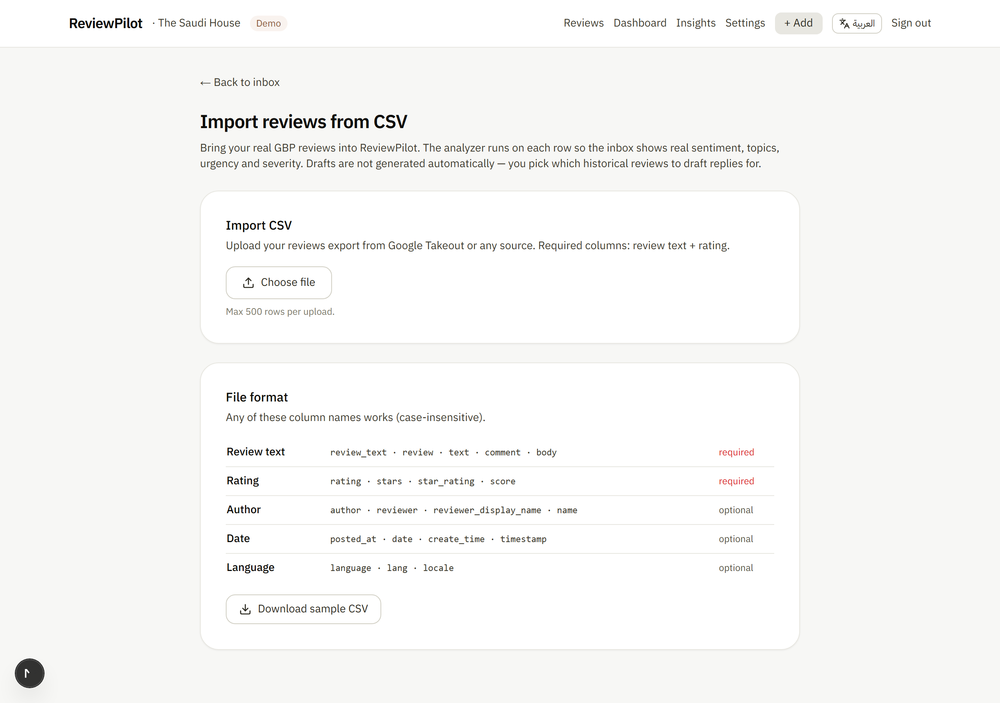
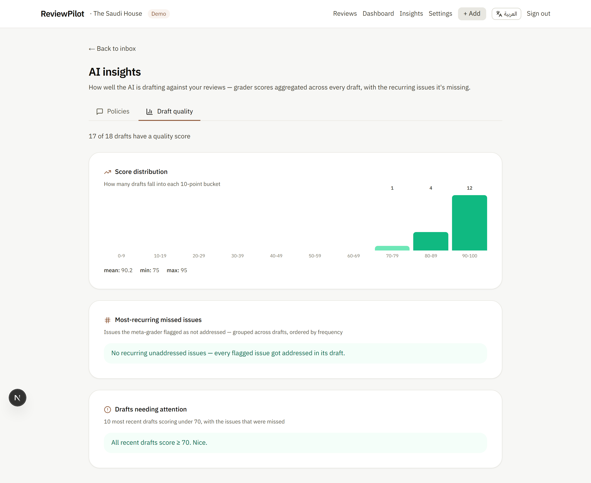
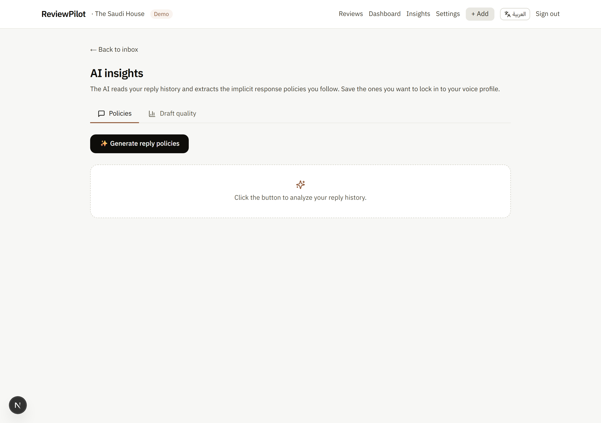
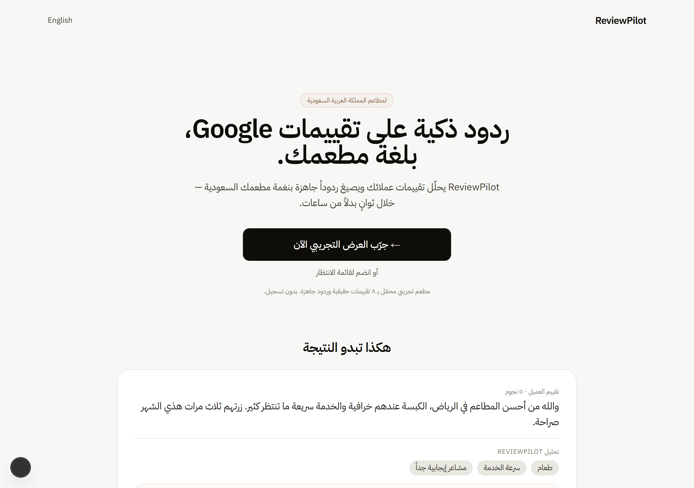

# ReviewPilot

> AI that drafts Google review responses for Saudi restaurants — in the owner's voice, in the right dialect, in seconds instead of hours.

**[➡️ Try the live demo](https://reviewpilot-drab-two.vercel.app)** &nbsp;·&nbsp; no signup required, click "Try the demo" on the login page.


---

## What it does

Saudi restaurant owners spend hours replying to Google reviews. The hard part isn't writing the reply — it's matching the **register** (Gulf casual vs formal MSA vs English code-switched), addressing every concrete issue the reviewer raised, and not sounding like an AI cliché generator. ReviewPilot does the heavy lifting:

**Owner flow:** paste a review → analyzer tags language / sentiment / urgency / severity / topics → drafter writes a reply in the right dialect with the restaurant's voice profile → meta-grader scores the draft against each concrete issue → owner edits, saves, and copies to clipboard. The whole loop runs in ~10 seconds with streaming output (no spinner-block).

**Learning loop:** every time the owner edits a draft and saves, that edit becomes a few-shot example in the next drafter call. The AI literally adopts the owner's voice with use — no fine-tuning, no model retraining. The same flow surfaces "implicit reply policies" on the `/insights` page (the AI reads 20 reply pairs and extracts what the owner consistently does) and "voice-profile tweaks" on `/settings` (rule-level adjustments based on edit patterns).

**Real data path:** real GBP reviews flow in via `/inbox/import` — CSV upload with flexible column matching for Google Takeout exports, Trustpilot dumps, or hand-rolled spreadsheets. The analyzer runs sequentially with SSE progress, halts on quota cleanly. No more demo-only stories.

---

## Screenshots

| | |
|---|---|
|  |  |
| **Inbox** — urgency-first sort, 5 filter axes (urgency / sentiment / language / status / severity) | **Dashboard** — sentiment trend, topic × sentiment heatmap, urgency split, topic trends |
|  |  |
| **CSV import** — alias-based column matching, 500-row cap, streaming per-row analyzer progress | **AI quality dashboard** — score distribution, recurring missed issues, drafts needing attention |
|  |  |
| **Policy generator** — meta-AI extracts implicit reply rules from history; save any to the voice profile | **Settings** — voice profile + auto-tune suggestions + learn-from-edits log |
|  |  |
| **Landing** — bilingual (Arabic primary, English at `/en`) | **Mobile** — 390px, RTL responsive |

---

## Why it's interesting — AI choices

- **Provider abstraction across three backends.** Every AI call goes through `src/ai/client.ts`, which dispatches to one of three adapters in `src/ai/providers/`: Groq (Llama 3.3 70B, default — free 100k TPD, no card), Gemini (Flash-Lite + Flash, perpetual free 20 RPD/model), or Anthropic (Haiku 4.5, needs credit). Schemas are plain JSON Schema; each adapter handles its native quirks (Gemini's `Type` enum, Anthropic's tool-use, Groq's OpenAI-style function calling). Switch with `AI_PROVIDER=groq|gemini|anthropic`. Made the cross-provider benchmark possible.

- **Two-tier model pipeline.** `fast` tier for cheap classification (analyzer + quality grader), `smart` tier for drafts where quality matters. On Gemini those map to Flash-Lite + Flash; on Groq and Anthropic both tiers currently use the same model. Call sites use tier names (`MODELS.fast`/`MODELS.smart`), provider-agnostic.

- **Reviewer-register matching.** A doctor writing formal MSA gets a formal MSA reply, even if the restaurant's voice profile says Gulf casual. Code-switched reviewers get code-switched replies. The drafter prompt matches the reviewer's register, not the restaurant's.

- **Forbidden phrases as data.** Both English and Arabic AI-cliché phrases are explicitly blocked in the drafter prompt: `"We strive to provide..."`, `"Thank you for taking the time..."`, `"نسعى دائمًا"`, `"ملاحظاتكم القيمة"`, `"نتطلع لخدمتكم"`. Discovered and added through iteration on real sample reviews.

- **Three-stage AI pipeline.** Each review goes through (1) analyzer → typed JSON classification, (2) drafter → streaming text response, (3) meta-grader → scores the draft 0–100 against each concrete issue the reviewer raised. Stage 3 is failure-tolerant — if it 429s the draft still saves and the quality card is hidden.

- **Streaming draft generation.** The manual-paste flow uses SSE so the owner watches the AI type the response character-by-character — no spinner block, no 10-second blank wait. Server emits `analysis` → `chunk`* → `draft` → `quality` → `done`; the client reads via `fetch.body.getReader()`.

- **Learn-from-edits — the closest thing to fine-tuning we ship without retraining.** Every owner edit becomes a few-shot `(reviewText, original_draft, owner_edit)` example in the next drafter call's system prompt. Bounded at 5 examples to keep token cost stable. Visible in `/settings` ("AI is learning from N past edits").

- **"Improve this draft" — conversational rewrite.** Owner types `"اجعلها أقصر"` or `"more apologetic"`; the model rewrites the current draft preserving language and register while obeying the instruction.

- **Severity classifier — second axis beyond urgency.** Urgency answers "how fast"; severity answers "what kind of attention". `urgent_action` (allergen, hygiene crisis, regulator threat) vs `direct_reply` (standard public response) vs `monitor` (vague / low-signal) vs `spam` (troll / competitor smear). Lets the inbox split "respond on Google" from "call the customer offline" from "ignore".

- **Reason-code error contract.** Server actions and SSE error events never emit user-facing strings — only reason codes (`'quota'`, `'not-found'`, `'no-draft'`, etc). Clients map `(locale, reason)` to a localized string. Prevents Arabic strings leaking into English UI and vice versa, and gives a grep-able invariant.

---

## Benchmark

Verified against a held-out golden set of **25 hand-curated Saudi-restaurant reviews** in `samples/reviews.ts` (Gulf rave, hygiene complaint with regulator threat, delivery-app context, prayer-time issue, allergy reaction, expat-English, formal sheikh, code-switched, vague-negative, and more). Each entry has an `expected` block declaring target language / dialect / sentiment range / urgency / severity / topic substrings.

`npm run benchmark [-- --count=N | --ids=a,b,c]` runs the full pipeline (analyzer → drafter → meta-grader) and appends a pass/fail table to [`benchmark-results.md`](benchmark-results.md).

**Latest run — Groq Llama 3.3 70B (21 of 25 samples before TPD limit):**

| Axis | Pass |
|---|---|
| Language detection | 21/21 |
| Sentiment (within range) | 21/21 |
| Urgency | 17/21 |
| Severity | 21/21 |
| Topic substring match | 20/20 |
| Quality (meta-grader, mean) | 90.2 |

Two honest caveats documented in `benchmark-results.md`:

1. **Self-grading bias** — on `groq` and `anthropic` both tiers use the same model, so the grader inflates its own scores. Gemini's split-tier setup (Flash-Lite grader, Flash drafter) gives the cleanest quality number.
2. **Llama foreign-token leak** — Llama 3.3 70B occasionally bleeds Greek/Russian tokens into Arabic drafts (e.g. `كبسة μας`). The current grader doesn't penalize this; future iteration could add a language-purity check.

---

## Architecture

```
                ┌──────────────────────────┐
                │  Next.js 15 app router   │
                │  Server actions + SSE    │
                └────────────┬─────────────┘
                             │
              ┌──────────────┼──────────────┐
              │              │              │
         ┌────▼──────┐  ┌────▼──────┐  ┌───▼─────────┐
         │   Auth    │  │  Drizzle  │  │ AI client   │
         │ BetterAuth│  │   ORM     │  │ (dispatcher)│
         └────┬──────┘  └────┬──────┘  └───┬─────────┘
              │              │             │
              ▼              ▼             ▼
         ┌─────────┐    ┌─────────┐  ┌──────────────────┐
         │ Resend  │    │  Neon   │  │ Provider adapter │
         │ (email) │    │ Postgres│  │ groq | gemini |  │
         └─────────┘    └─────────┘  │     anthropic    │
                                     └──────┬───────────┘
                                            │
                                            ▼
                                     ┌──────────────┐
                                     │  Llama 3.3   │
                                     │  Gemini 2.5  │
                                     │  Claude H4.5 │
                                     └──────────────┘
```

Auth lane: magic-link via Resend (or console-log in dev) + a portfolio-only demo-mode cookie for visitors. Data lane: Drizzle ORM over Neon Postgres. AI lane: a thin dispatcher behind plain JSON Schema, three provider adapters, retry-on-429 logic per provider.

---

## Run locally

```bash
git clone https://github.com/abdulelah-cs7890/reviewpilot
cd reviewpilot
npm install

# Copy env template and fill in your keys
cp .env.example .env.local
# Required: DATABASE_URL (free at neon.tech) + ONE AI provider key:
#   GROQ_API_KEY      — recommended (free 100k TPD, no card)
#   GEMINI_API_KEY    — fallback (perpetual free 20 RPD/model)
#   ANTHROPIC_API_KEY — premium; needs credit balance
# Optional: AI_PROVIDER=groq|gemini|anthropic to force one.

npm run db:generate
npm run db:migrate
npm run db:seed      # demo restaurant + 10 pre-analyzed reviews
npm run dev          # http://localhost:3000
```

Other useful scripts:

```bash
npm run benchmark                    # 5 samples on default provider
npm run benchmark -- --count=25      # full golden set
npm run benchmark -- --ids=a,b,c     # targeted re-run after a prompt tweak
npm run screenshots                  # regenerate README screenshots
```

---

## Tech

Next.js 15 (App Router, Turbopack) · TypeScript · Drizzle ORM · Neon Postgres · BetterAuth · Resend · Tailwind CSS · Sonner · Lucide · `@google/genai` + `@anthropic-ai/sdk` + `groq-sdk` · Playwright (for screenshots) · Zod.

---

## What's deferred (intentionally)

These are scope decisions, not bugs. Each is a "would build if this were a real SaaS, but it's a portfolio project" call.

- **Real GBP API posting.** The "Schedule reply for later" feature flips draft status to `responded` via a Vercel cron, but doesn't actually publish to Google — that's a multi-week GBP API approval process. Out of scope for a single-developer portfolio piece.
- **Multi-user invites / team accounts.** One user per restaurant. A real restaurant would have an owner + assistant manager sharing access; that needs a `restaurant_members` join table plus refactoring every "find restaurant for user" query (~15+ sites) plus a token-based invite/accept flow. Audited in [Phase 14](#notes-for-portfolio-reviewers), explicitly deferred — the refactor risk doesn't pay for itself in portfolio value since reviewers won't sign up two test accounts to try it.
- **WhatsApp Cloud API.** Referenced in prompts ("offer WhatsApp follow-up") but the actual send is the owner's job.
- **Real-time push notifications.** Owner sees unread counts via an in-app nav badge ([Phase 14](#notes-for-portfolio-reviewers)) but no email/web-push when reviews arrive.
- **Pricing / billing.** No Stripe, no usage tracking. Aligned with the "no money spent" constraint.
- **Production AI provider: Gemini stays the default.** Even though Groq is more permissive locally, the live Vercel deploy uses Gemini (perpetual free tier, no credit dependency). The provider abstraction means either works.

---

## Notes for portfolio reviewers

This is a single-developer project shipped across **15 phases**, each visible as a sequence of commits in the git log. Phases of note:

- **Phase 1** — 25-review golden set + typed `responseSchema` + Gulf-Arabic prompt tuning
- **Phase 4** — Three-stage AI pipeline (analyzer → drafter → meta-grader)
- **Phase 6** — SSE streaming draft generation
- **Phase 7** — Learn-from-edits + customer timeline + bulk paste
- **Phase 8** — Severity classifier + topic trends + schedule-for-later + auto-tune + policy generator
- **Phase 9** — Real-data CSV ingestion + benchmark suite + AI quality dashboard
- **Phase 11** — Provider abstraction (Groq + Gemini + Anthropic)
- **Phase 12** — Analyzer schema fix + full server↔client error-code refactor (every action returns reason codes, clients localize)
- **Phase 13** — README + screenshot refresh
- **Phase 14** — User-readiness audit + Tier 1/2 fixes: account deletion + email change + restaurant rename + CSV export + Privacy/Terms pages + text search + unread badge + `/admin` observability
- **Phase 15** — First-time user walkthrough: DB-state-driven Getting Started checklist + opt-in product tour overlay

What you're looking at is not a demo — it's a working tool with measurable AI quality on real data, with the iteration history visible in `git log`. Run `npm run benchmark` to reproduce the numbers in [`benchmark-results.md`](benchmark-results.md).

Every gap in the "What's deferred" section above is a deliberate scope call — audited in Phase 14, not an oversight.
